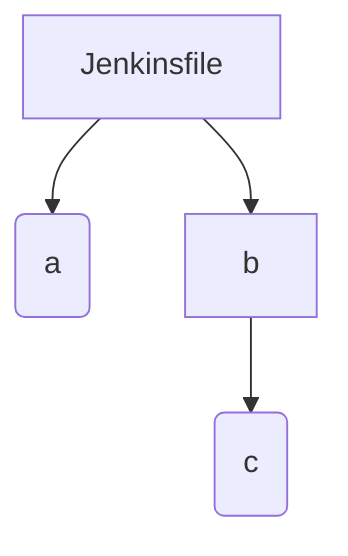

# Jenkins 2 diagrams

This script converts a folder of Jenkins files into a visual representation.

# Inputs

Specify a path to your project.
`Jenkinsfile.*` and any files ending with `.jenkinsfile` will be scanned

# Options

With `.jenkinsfile`s, the file isn't enough to state whether they are used as a top-level pipeline in Jenkins (vs being
called by a higher-level pipeline).

To create a more accurate visual representation of your pipelines, add this line to the top of your Jenkins files which
are called directly from the Jenkins UI:

```groovy
// jenkins2diagram:toplevel
```

# Supported outputs

Here's a few options - I'm considering:

- Mermaid diagram
    - Renders in GitHub .md previews
    - Renders in Docusaurus (a static website tool)
- ~Ascii art~
    - Renders anywhere
- ~Image files~

I'll focus on mermaid first.
I think the app will return text to stdout, which can be piped `>` by the user into a file if they wish.

# Developing a POC

This app is quite domain / keyword specific, so for this POC I aim to:

- [ ] Get the basic file reading, pipeline mappings, etc. correct with simplified syntax:

```
# Jenkinsfile 
// jenkins2diagram:toplevel
build job: 'a'
build job: 'b'

// a.jenkinsfile

// b.jenkinsfile
build job: 'c'

// c.jenkinsfile
```

Should produce:



- [ ] Change to support more proper syntax
- [ ] Be more flexible with matches (`build(job: '...',...)` vs `build job:'...'`, etc.))